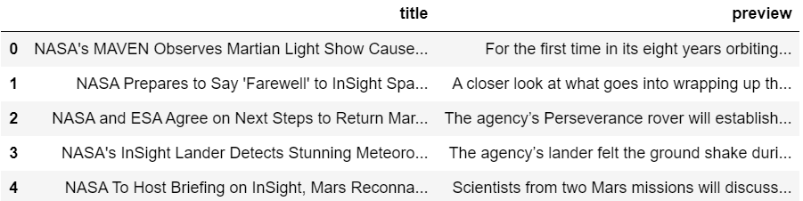
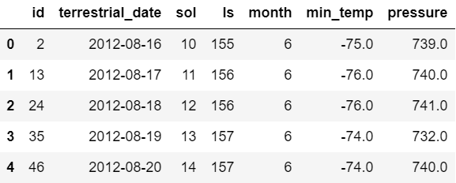
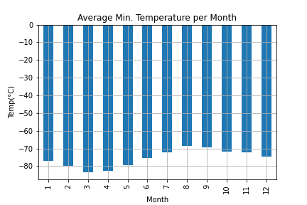
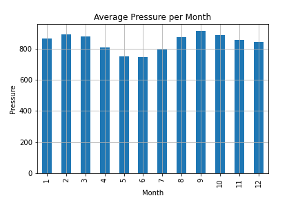
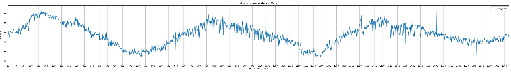

# Web Scrapping Challenge
## Introduction
Web scrapping from mock site to collect data and:
1. Create a JSON file listing article titles and content preview.
2. Import table information from website, manually creating a Pandas DataFrame and plotting information from it.

## Data Processing
* Article Titles  
    * Used automated browsing to visit the [Mars news site](https://static.bc-edx.com/data/web/mars_news/index.html).  
    * Extracted the titles and preview text of the news articles from the HTML using Beautiful Soup.  
    * Stored the scraping results, each title-and-preview pair in a Python dictionary. Gave each dictionary two keys: title and preview.  
    * Stored all the dictionaries in a Python list and printed it.  
    * Displayed information as a DataFrame.
    
    * Finally exported data as a JSON file.
* Weather Info  
    * Used automated browsing to visit the [Mars Temperature Data Site](https://static.bc-edx.com/data/web/mars_facts/temperature.html).
    * Extracted the table information from the HTML using Beautiful Soup. 
    * Stored the data in a DataFrame.  
    
    * Modified data types.

## Questions for Mars Weather
How many months exist on Mars?  
* There are 12 months on Mars.  

How many Martian (and not Earth) days worth of data exist in the scraped dataset?  
* There are 1867 days in the dataset.  

What are the coldest and the warmest months on Mars (at the location of Curiosity)? 
* The hottest month is the 8th
* The coldest month is the 3rd

Which months have the lowest and the highest atmospheric pressure on Mars?  
* The month with the highest atmospheric pressure is the 9th
* The month with the lowest atmospheric pressure is the 6th

About how many terrestrial (Earth) days exist in a Martian year?  
* The data shows 3 peaks and 3 valleys:  
    * The values are 145-820-1480 for the peaks
        * This gives us two ranges: 1480-820=660 and 820-145=675
    * The values are 505-1180-1855 for the values
        * This gives us two ranges: 1855-1180=675 and 1180-505=675 
    
    
    * The average of these values gives us 671.25 days in a Martian year. According to Google a year in mars equals to 687 days on Earth. 

